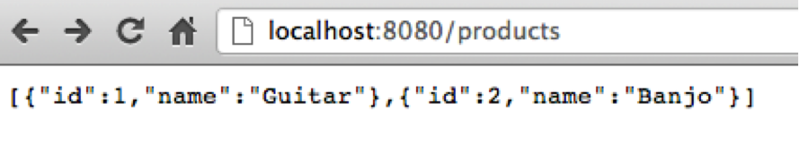
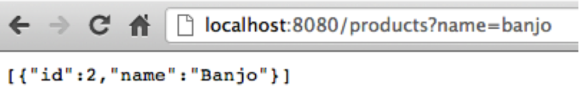

### A rich framework for building applications and services

**[Hapi](https://github.com/hapijs/hapi)** is a simple to use configuration-centric framework with built-in support for input validation, caching, authentication, and other essential facilities for building web applications and services. hapi enables developers to focus on writing reusable application logic instead of spending time building infrastructure, without getting in the way.

***Setup Products API***

Run `npm install`.

<pre><code>
var Hapi = require('hapi');
var routes = require('./routes');

var server = new Hapi.Server('localhost', 8000);

// Add the routes
server.route(routes);

server.start();
</code></pre>

In the _server.js_ code above a new instance of the hapi server is started.

[Hapi](https://github.com/spumko/hapi/) provides a function for adding a single route or an array of routes.  In this example we are adding an array of routes from a routes module. Our _routes.js_ file contains the route information and handlers.  When defining the routes we will also be specifying [validation requirements](http://spumko.github.io/resource/api/#hapi-types).  Therefore, at the top of the file require _hapi_ and assign its _Types_ property to a local variable like below.

***Sample Routes***

For this example four routes have been created.  Here is the route array in the _routes.js_ file.

<pre><code>
module.exports = [
   { method: 'GET', path: '/hello', handler: getHello },
   { method: 'GET', path: '/products', handler: getProducts },
   { method: 'GET', path: '/products/{id}', handler: getProduct,
      config: {
         validate: {
            params: {
               id: Joi.number()
                .required()
            }
         }
      }
   },
   { method: 'POST', path: '/products', handler: addProduct,
      config: {
         validate: {
            payload: { limit: Joi.number().integer() }
         }
      }
   }
];
</code></pre>

The routes are exported as an array so that they can easily be included by the server implementation.
For the products listing endpoint we are allowing a querystring parameter for name.
When this querystring parameter exists then we will filter the products for those that have a matching name.

The third route is a very simple route that demonstrates how a parameter can become part of the path definition.
This route will return a product with the matching ID that’s requested.

In the last route, the one used for creating a product, you will notice that extra validation requirements are added.
The request body must contain a parameter for name that has a minimum of 3 characters.

Next add the handlers to the _routes.js_ file.

<pre><code>
function getProducts(request, reply) {

    if (request.query.name) {
        request.reply(findProducts(request.query.name));
    }
    else {
        reply(products);
    }
}

function findProducts(name) {

    return products.filter(function(product) {
        return product.name.toLowerCase() === name.toLowerCase();
    });
}

function getProduct(request, reply) {

    var product = products.filter(function(p) {
        return p.id === request.params.id;
    }).pop();

    reply(product);
}

function addProduct(request, reply) {

    var product = {
        id: products[products.length - 1].id + 1,
        name: request.payload.name
    };

    products.push(product);

    reply(product).code(201).header('Location,: /products/' + product.id);
}
</code></pre>

As you can see in the handlers, hapi provides a simple way to add a response body by using the _request.reply_ function.
Also, in the instance when you have created an item you can use the
_request.reply({}).code(201).header('Location', '/products/' + product.id)_ functions to send a 201 response
and set a custom response header.

Lastly, add a simple array to contain the products that the service will serve.

<pre><code>
var products = [{
        id: 1,
        name: 'Guitar'
    },
    {
        id: 2,
        name: 'Banjo'
    }
];
</code></pre>

***Running the server***

Start the server by right clicking the index.js file and selecting "Create 'index.js'...
Now you can navigate to <http://localhost:8000/docs> to see the documentation for the routes.
To see a list of the products navigate to <http://localhost:8000/products>.
Below is a screenshot of what the response looks like.

Go ahead and append ?name=banjo to the URL to try searching for a product by name.

Use curl or a REST console to create a product.  Make a POST request to the products endpoint with a name in the body.
Using curl the command looks like: ``curl http://localhost:8000/products -i -d "name=Trumpet"``.
Below is an example of the response headers from making a request to create a product.

<pre><code>
HTTP/1.1 201 Created
Content-Type: application/json; charset=utf-8
Location: /products/3
Content-Length: 25
Cache-Control: no-cache
Date: Sat, 29 Jun 2013 16:44:42 GMT
Connection: keep-alive

{"id":4,"name":"Trumpet"}
</code></pre>

Now if you navigate to the _Location_ specified in the response headers you should see the product that you created.

Other features
There are a lot of different configuration features that you can add to the server.
The extensive list can be found in the API documentation at [/docs/Reference.md#server-properties](/docs/Reference.md#server-properties).

The built-in cache support has providers for memory, mongo and redis.
Setting up cache is as simple as passing cache: true as part of the server configuration.

Additionally, there are several configuration options available on a per route basis.
The full list can be found at [/docs/Reference.md#serverrouteoptions](/docs/Reference.md#serverrouteoptions).
For example, caching expiration times can also be configured on a per route basis.
Also, you can have per-route authentication settings.

### Additional information

- For a self-guided lesson on hapi, use [Make Me Hapi](https://github.com/hapijs/makemehapi).
- For a full application example, check out [postmile](https://github.com/hueniverse/postmile).
- Information about the **8.0 release candidate** :
    - [API reference for 8.0](/docs/Reference.md)
    - [Upcoming breaking changes in 8.0](https://github.com/hapijs/hapi/issues?labels=breaking+changes)
- Any **issues or questions**, post it to our [slack](https://proridium.slack.com/) site.
